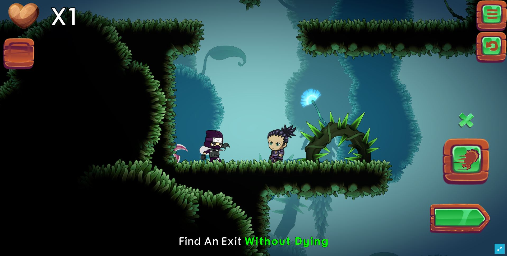
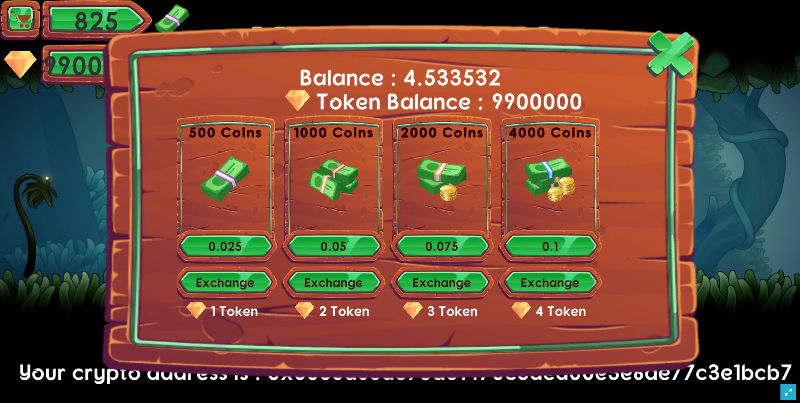
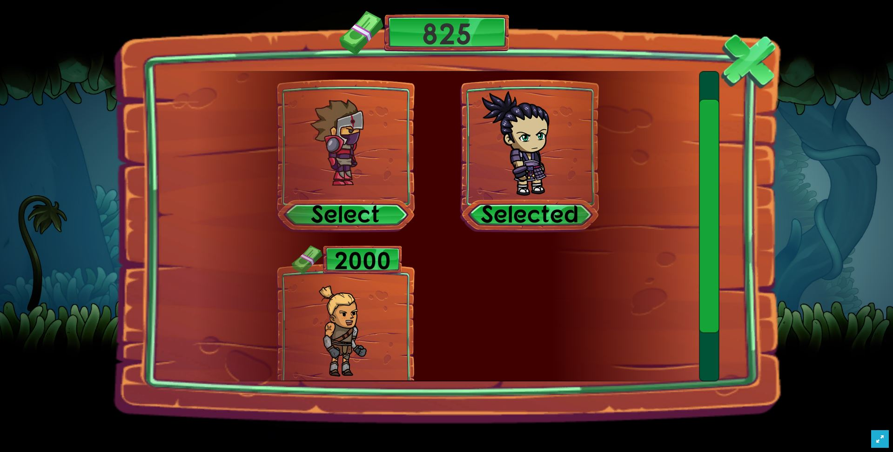
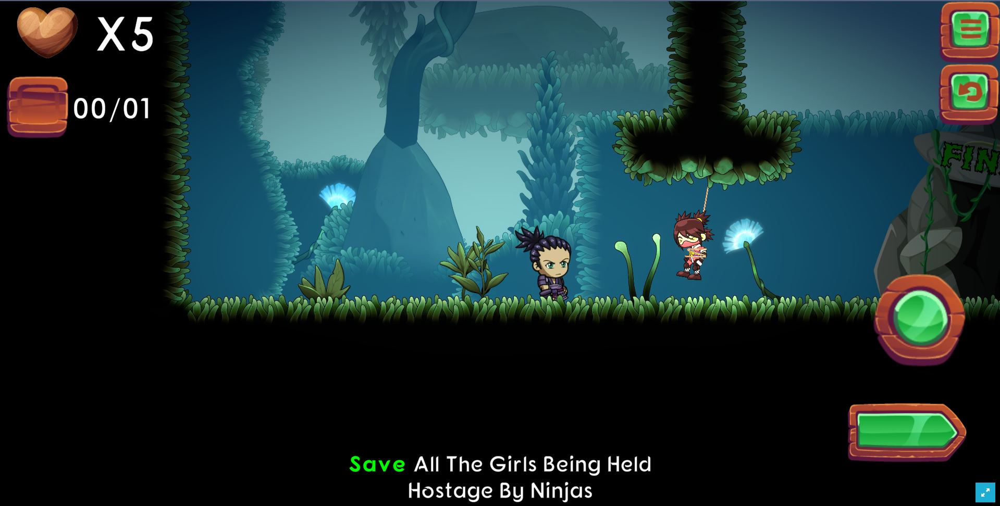

### Ninja Dash is an amazing platformer game loaded with FVM web3 features and full of fun.

### [Click here to Play](https://www.thundergamestudio.com/web3/ninjadash/)

## Features
- Amazing platformer game loaded with FVM web3 features
- Decentralized finance system with in-game store
- Get FREE in-game token when you complete level with 3 stars
- Unlock characters as NFT
- Get coins in exchange of tokens or buy from native FVM balance

## Technologies  ***(Click on link to know more about use)***
- FVM Hyperspace Testnet blockchain to play (NFT, DeFi, Game Token etc)
  * [FVM Hyperspace Testnet](https://github.com/NinjaDash/NinjaDash/blob/main/FVMTestnet.md)
- [IPFS/Filecoins used to store and fetch NFT Metadata](https://github.com/NinjaDash/NinjaDash/blob/main/NFT.Storage.md)
- Remix IDE used to create smart contract for ERC-1155 NFT, ERC-20 game token and in-app purchase for coins
- Unity Game Engine and Web3 Libraries

### Ninja Dash Game - (Play - Enjoy - Earn - Spend)

